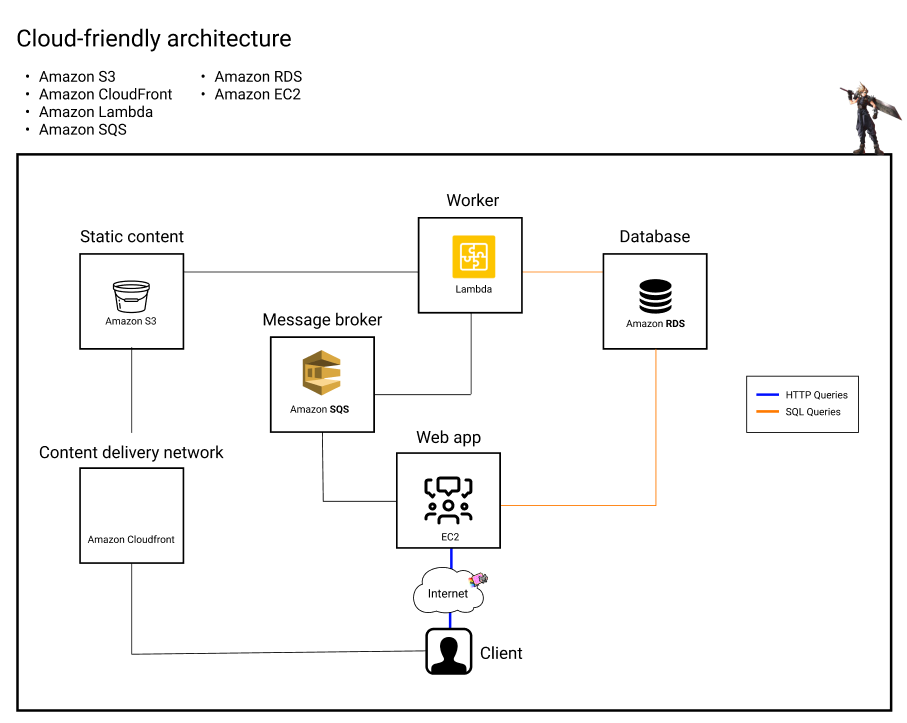

rmq_docker_go
====
#### ***Docker & Golang - FaaS implementation***
The aim of this project is to experiment FaaS (Function as a service), by implementing an infrastructure which allows a user to upload one image and get it resized, using a message broker and workers.

# Project Status
*This repo is a [HETIC school](https://www.hetic.net/) project and its purpose is purely educational.* 

*Feel free to fork the project, but be aware that development might slow down or stop completely at any time, and that we are not looking for maintainers or owner.*

# Table of Contents
- [Project Status](#project-status)
- [Overview](#overview)
  - [Todo](#todo)
- [Getting Started](#getting-started)
  - [Requirements](#requirements)
  - [Installation](#installation)
  - [Quick Start](#quick-start)
  - [Deployment](#deployment)
- [Known Issues](#known-issues)
- [Built With](#built-with)
- [Team Members](#team-members)
- [Acknowledgments](#acknowledgments)
- [License](#license)

# Overview




## Todo 
***before*** June 22th :
- send an e-mail to the teacher with a link towards this repo.
- make the teacher a contributor (if the repo isn't public).
> note: we shall all be in copy of the e-mail.

The repo should include :
* the code corresponding to the "local" version
* with a complete Readme, including 
    * the 2 schemas (any format is fine)
    * how to run the app
    * how to test it (e.g.: does it launch a localhost:8080 with an interface and an image ?)

# Getting Started
These instructions will get you a copy of the project up and running on your local machine for development and testing purposes. See [deployment](#deployment) section for notes on how to deploy the project on a live system.

## Requirements
* [Golang](https://golang.org/dl/) (v1.15.8 or higher.)
* Docker installed and running
* Familiarity with basic Docker functionality and commands

## Installation

## Quick Start
````
sudo docker run
````
````golang
go run .
````
Congratulations.

## Deployment
--

# Known Issues
None (yet)

# Built With
* [Docker](https://www.docker.com/) - Application packaging solution
* [Golang](https://golang.org/) - Open source programming language
* [rmq](https://github.com/adjust/rmq) Golang message queue system

# Team Members
* **Lucas Lehot** - [lucaslehot](https://github.com/lucaslehot)
* **Cyrille Banovsky** - [Ban0vsky](https://github.com/Ban0vsky)
* **Quentin Maillard** - [Tichyus](https://github.com/Tichyus)
* **Corentin Boulanouar** - [Shawnuke](https://github.com/Shawnuke)

# Acknowledgments
* 

# License
This project is licensed under the terms of the [MIT](https://opensource.org/licenses/MIT) license.

